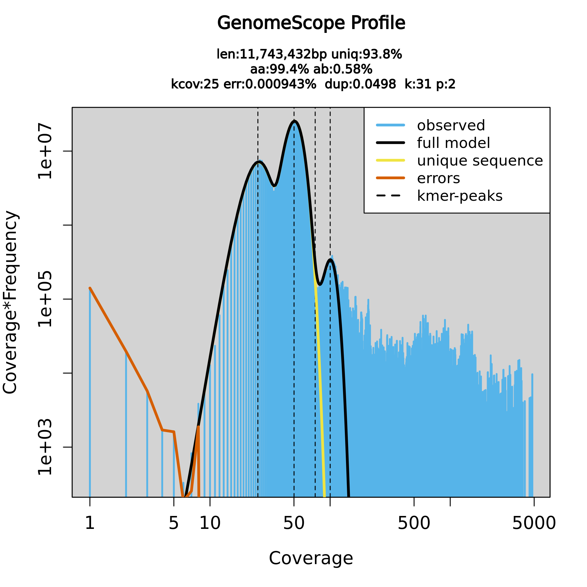
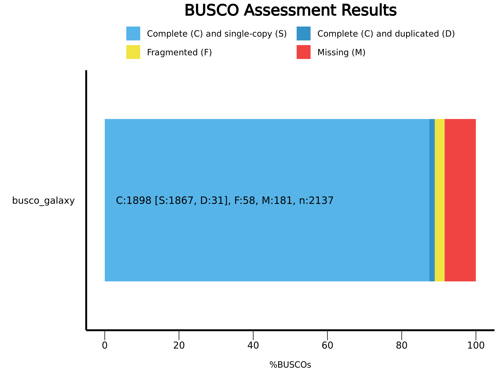
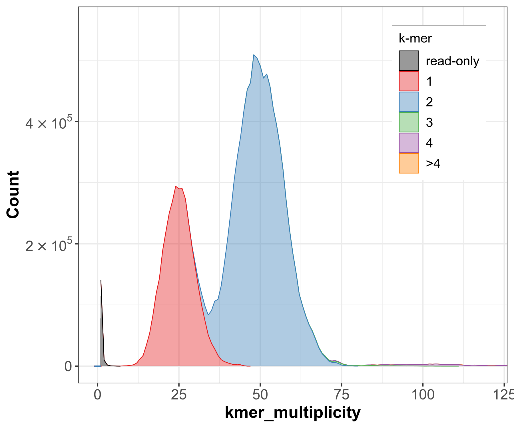
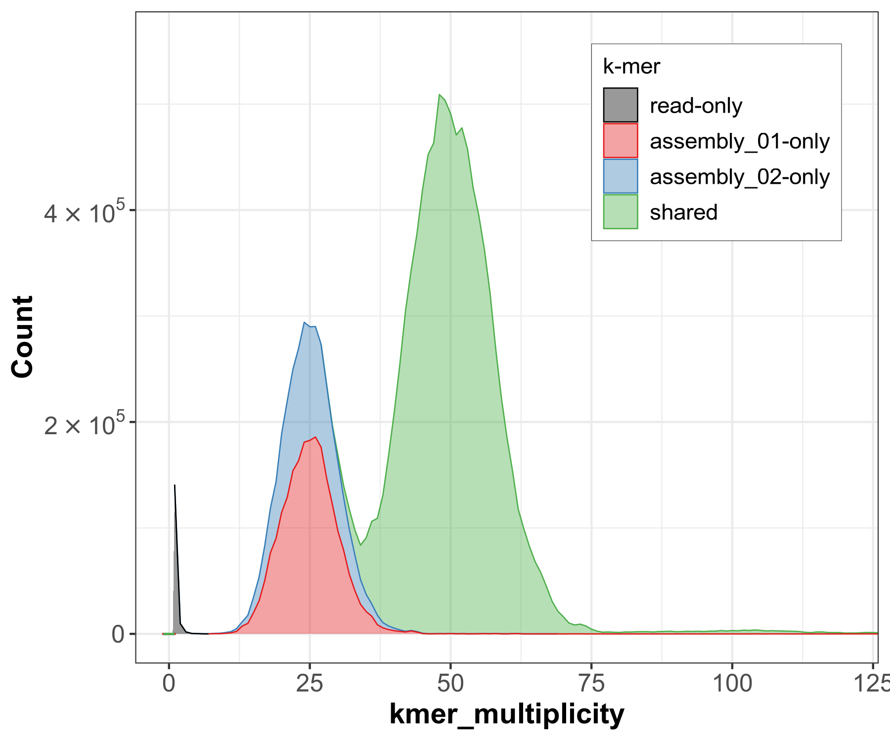
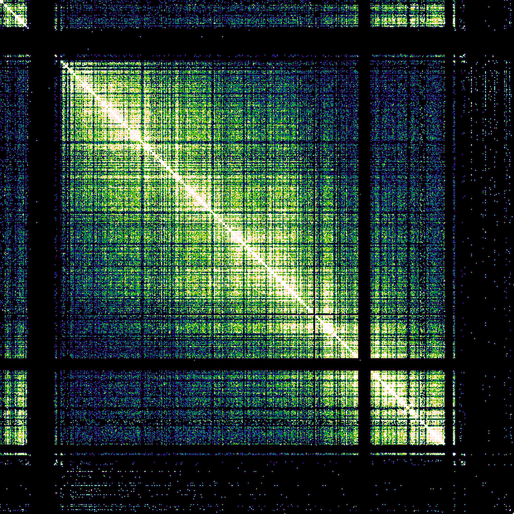

# Chromosome-Level Genome Assembly of *Saccharomyces cerevisiae* S288C Using the VGP Pipeline

> **Platform:** Galaxy Europe | **Organism:** *Saccharomyces cerevisiae* S288C | **Pipeline:** Vertebrate Genome Project (VGP)

---

## Overview

This report documents a complete, chromosome-scale *de novo* genome assembly of *Saccharomyces cerevisiae* S288C, carried out using the [Vertebrate Genome Project (VGP)](https://vertebrategenomesproject.org/) pipeline on [Galaxy Europe](https://usegalaxy.eu). The workflow integrates three complementary sequencing technologies to produce a high-contiguity, near-error-free assembly:

| Technology | Role in Pipeline |
|---|---|
| **PacBio HiFi** | Long-read contig assembly |
| **Bionano optical mapping** | Hybrid scaffolding to resolve large structural gaps |
| **Illumina Hi-C** | Chromosome-scale scaffolding via chromatin proximity ligation |

The final assembly achieves **99.99% k-mer completeness** (Merqury) and **95.4% BUSCO completeness**, producing 17 scaffolds that correspond precisely to the 16 nuclear chromosomes and mitochondrial DNA of *S. cerevisiae* S288C.

---

## Table of Contents

1. [Introduction](#1-introduction)
2. [Methods](#2-methods)
   - [Tools and Versions](#tools-and-versions)
   - [Pipeline Architecture](#pipeline-architecture)
   - [Input Datasets](#input-datasets)
3. [Results](#3-results)
   - [Genome Profile Analysis](#31-genome-profile-analysis)
   - [HiFi Contig Assembly](#32-hifi-contig-assembly-with-hifiasm)
   - [Assembly Completeness — BUSCO](#33-assembly-completeness--busco)
   - [Assembly Quality — Merqury](#34-assembly-quality--merqury)
   - [Bionano Hybrid Scaffolding](#35-bionano-hybrid-scaffolding)
   - [Hi-C Chromosome Scaffolding](#36-hi-c-chromosome-scaffolding-with-yahs)
   - [Final Assembly Statistics](#37-final-assembly-statistics)
4. [Discussion](#4-discussion)
5. [Conclusion](#5-conclusion)
6. [Repository Structure](#6-repository-structure)
7. [References](#7-references)

---

## 1. Introduction

The **Vertebrate Genomes Project (VGP)**, coordinated by the Genome 10K (G10K) consortium, aims to produce reference-quality, haplotype-phased, chromosome-level genome assemblies for all ~70,000 extant vertebrate species. The core philosophy of the VGP pipeline is to combine multiple orthogonal technologies so that the strengths of each compensate for the limitations of the others — long HiFi reads span repetitive regions, optical maps resolve large-scale structural variation, and Hi-C data provides chromosomal context.

*Saccharomyces cerevisiae* S288C was selected as the model organism for this assembly due to its compact, well-characterised genome (~12 Mb, 16 chromosomes), which provides a robust benchmarking framework. A synthetic diploid HiFi dataset was used, enabling rigorous evaluation of the pipeline's ability to resolve haplotypes and recover the complete genome.

---

## 2. Methods

### Tools and Versions

| Tool | Version | Function |
|---|---|---|
| Cutadapt | 4.4+galaxy0 | Adapter trimming of HiFi reads |
| Meryl | 1.3+galaxy6 | K-mer database construction |
| GenomeScope2 | 2.0+galaxy2 | K-mer-based genome size and heterozygosity estimation |
| Hifiasm | 0.19.8+galaxy0 | Haplotype-resolved HiFi assembly |
| gfastats | 1.3.6+galaxy0 | Assembly contiguity statistics |
| BUSCO | 5.5.0+galaxy0 | Gene-space completeness assessment |
| Merqury | 1.3+galaxy3 | Reference-free k-mer quality and completeness scoring |
| Bionano Hybrid Scaffold | 3.7.0+galaxy3 | Optical map-guided scaffolding |
| BWA-MEM2 | 2.2.1+galaxy1 | Hi-C read alignment |
| Filter and Merge | 1.0+galaxy1 | Chimeric Hi-C read filtering |
| PretextMap | 0.1.9+galaxy0 | Hi-C contact map visualisation |
| YaHS | 1.2a.2+galaxy1 | Hi-C-based chromosome scaffolding |

### Pipeline Architecture

The assembly proceeded through four sequential stages:

```
Raw HiFi Reads
      │
      ▼
[Stage 1] K-mer Profiling  ──── Meryl + GenomeScope2 → genome size, heterozygosity
      │
      ▼
[Stage 2] Contig Assembly  ──── Hifiasm (Hi-C mode) → Hap1 + Hap2 phased contigs
      │
      ▼
[Stage 3] Bionano Scaffolding ─ Hybrid Scaffold → optical map-integrated scaffolds
      │
      ▼
[Stage 4] Hi-C Scaffolding  ─── YaHS → chromosome-scale final assembly
```

### Input Datasets

| Dataset | Format | Source (Zenodo) |
|---|---|---|
| PacBio HiFi reads (×3 files) | FASTA | [6098306](https://zenodo.org/record/6098306) |
| Hi-C forward reads | FASTQ.GZ | [5550653](https://zenodo.org/record/5550653) |
| Hi-C reverse reads | FASTQ.GZ | [5550653](https://zenodo.org/record/5550653) |
| Bionano optical map | CMAP | [5887339](https://zenodo.org/record/5887339) |

---

## 3. Results

### 3.1 Genome Profile Analysis

Prior to assembly, k-mer frequency profiling was conducted using **Meryl** (k = 31) and **GenomeScope2** to estimate key genome parameters without relying on a reference sequence.

#### GenomeScope2 Output Summary

| Parameter | Minimum Estimate | Maximum Estimate |
|---|---|---|
| Haploid genome length | 11,739,513 bp | 11,747,352 bp |
| Repetitive sequence length | 723,114 bp | 723,597 bp |
| Unique sequence length | 11,016,399 bp | 11,023,756 bp |
| Heterozygosity | 0.5759% | 0.5835% |
| Model fit | 92.52% | 96.52% |
| Read error rate | 0.00094% | 0.00094% |

> **Genome size used for downstream assembly: 11,747,160 bp**

#### Interpretation

The k-mer histogram produced a bimodal distribution, as expected for a heterozygous diploid organism. The **heterozygous peak** appears at approximately 25× coverage and the **homozygous peak** at approximately 50× coverage. The extremely low estimated read error rate (~0.001%) reflects the high base-calling accuracy of PacBio HiFi chemistry. The model fit of >92% across the range indicates a reliable genome size estimate.


*Figure 1. GenomeScope2 linear-scale k-mer frequency plot showing heterozygous and homozygous peaks.*


*Figure 2. GenomeScope2 log-scale plot providing greater resolution of the low-frequency k-mer tail.*

---

### 3.2 HiFi Contig Assembly with Hifiasm

Hifiasm was executed in **Hi-C phased assembly mode**, leveraging chromatin proximity data to partition reads into maternal and paternal haplotypes, producing two independent contig sets (Hap1 and Hap2).

#### gfastats Contig Assembly Statistics

| Statistic | Haplotype 1 | Haplotype 2 |
|---|---|---|
| Number of contigs | 17 | 16 |
| Total assembly length | ~12.16 Mb | ~11.30 Mb |
| Scaffold N50 | 923 KB | 922 KB |
| Contig N50 | 923 KB | 922 KB |
| Percentage gaps | 0.000% | 0.000% |

Both haplotypes exhibit **zero gap content**, confirming that HiFi reads were sufficient to span all repetitive regions at the contig stage. The N50 of ~923 KB indicates a highly contiguous assembly, with half of the assembled sequence contained in contigs of at least this length.

---

### 3.3 Assembly Completeness — BUSCO

Assembly gene-space completeness was evaluated using **BUSCO v5** against the *Saccharomycetes* odb10 lineage dataset, which comprises **2,137 conserved single-copy orthologs**.

#### BUSCO Results

| Category | Haplotype 1 | Haplotype 2 |
|---|---|---|
| Complete BUSCOs (C) | 2,039 **(95.4%)** | 1,898 (88.8%) |
| Complete & Single-copy (S) | 1,999 (93.5%) | 1,867 (87.4%) |
| Complete & Duplicated (D) | 40 (1.9%) | 31 (1.5%) |
| Fragmented (F) | 68 (3.2%) | 58 (2.7%) |
| Missing (M) | 30 (1.4%) | 181 (8.5%) |
| Total BUSCOs searched | 2,137 | 2,137 |


*Figure 3. BUSCO completeness plot for Haplotype 1 (95.4% complete).*


*Figure 4. BUSCO completeness plot for Haplotype 2 (88.8% complete).*

#### Interpretation

Hap1 achieves **95.4% completeness**, placing it firmly within the range expected of a high-quality reference-grade assembly. The lower Hap2 completeness (88.8%) is a known artefact of phased assembly — the primary haplotype typically captures the majority of shared sequence, leaving the secondary haplotype with a less complete representation of conserved gene content. The low duplication rate (~1.9%) in Hap1 confirms that the phasing was effective, with minimal cross-contamination between haplotypes.

---

### 3.4 Assembly Quality — Merqury

Merqury provides a **reference-free** measure of base-level accuracy and sequence completeness by comparing assembly k-mers against those derived directly from the raw reads.

#### K-mer Completeness

| Assembly | K-mers Recovered | Total K-mers in Reads | Completeness |
|---|---|---|---|
| Haplotype 1 | 11,611,483 | 13,010,260 | 89.25% |
| Haplotype 2 | 10,792,811 | 13,010,260 | 82.96% |
| **Both combined** | **13,010,244** | **13,010,260** | **99.99%** |

#### Quality Value (QV) Scores

| Assembly | QV Score | Estimated Error Rate |
|---|---|---|
| Haplotype 1 | 79.74 | ~1 error per 10⁸ bp |
| Both combined | 82.60 | ~1 error per 10⁸ bp |

> A QV score of >60 is considered to exceed the Phred Q60 threshold, the gold standard for reference genome quality.


*Figure 5. Merqury spectra-cn plot. K-mers are coloured by copy number; the near-absence of "read-only" k-mers (grey) confirms near-complete assembly.*


*Figure 6. Merqury spectra-asm plot showing assembly-specific k-mer distribution across both haplotypes.*

#### Interpretation

The combined k-mer completeness of **99.99%** — where just 16 k-mers out of 13 million remain unrecovered — confirms that the two haplotypes together account for virtually the entire genomic sequence present in the reads. The exceptionally high QV scores (>79) indicate an assembly accuracy far exceeding conventional sequencing quality thresholds.

---

### 3.5 Bionano Hybrid Scaffolding

Bionano optical map data was integrated with the Hap1 contig assembly using the **Bionano Hybrid Scaffold** tool configured in VGP mode. This step uses long-range restriction enzyme-based optical maps to order and orient contigs at scales beyond the reach of sequence-based methods alone.

#### Scaffolding Statistics

| Metric | Value |
|---|---|
| Conflict cuts applied to Bionano maps | 0 |
| Conflict cuts applied to HiFi sequences | 0 |
| Number of hybrid scaffolds produced | 16 |
| Hybrid scaffold N50 | 923 KB |
| Total hybrid scaffold length | 12.075 Mb |
| Longest scaffold | 1.532 Mb |

The **absence of any conflicts** between the optical map and HiFi assembly — neither requiring cuts to the Bionano maps nor to the sequence contigs — is a strong indicator of structural concordance between the two independent data sources. This mutual validation substantially increases confidence in the correctness of the assembly at the large-scale structural level.

---

### 3.6 Hi-C Chromosome Scaffolding with YaHS

Hi-C paired-end reads were aligned to the Bionano-scaffolded assembly using **BWA-MEM2**, followed by chimeric read filtering. The resulting contact frequency data was used by **YaHS** to order and orient scaffolds into chromosome-scale pseudomolecules.

#### Hi-C Contact Maps

The quality of Hi-C scaffolding was visualised using **PretextMap**:


*Figure 7. Hi-C contact map prior to YaHS scaffolding. Contacts are distributed across multiple unordered scaffolds.*


*Figure 8. Hi-C contact map following YaHS scaffolding. Strong diagonal signal and 17 discrete chromosome-scale domains are clearly resolved.*

#### Interpretation

Post-scaffolding, the contact map displays the hallmark features of a correctly assembled chromosome-level genome: a **strong diagonal** representing intra-chromosomal contacts, **discrete off-diagonal blocks** at centromere and telomere regions, and **17 distinct topological domains** precisely matching the expected karyotype of *S. cerevisiae* (16 nuclear chromosomes + mitochondrial DNA).

---

### 3.7 Final Assembly Statistics

| Metric | Value |
|---|---|
| Final scaffold count | **17** |
| Expected chromosomes | 16 nuclear + 1 mitochondrial |
| Assembly N50 | ~923 KB |
| Total assembly length | ~12.16 Mb |
| Reference genome size | ~12.16 Mb |
| BUSCO completeness (Hap1) | **95.4%** |
| Merqury combined completeness | **99.99%** |
| Merqury QV (combined) | **82.60** |
| Scaffolding conflicts | **0** |

---

## 4. Discussion

This assembly demonstrates the power of integrating orthogonal genomic technologies within the VGP framework. Each technology contributes uniquely and non-redundantly:

- **PacBio HiFi** reads (~10–25 kb) provided the foundation for contig assembly, spanning most repetitive elements without the misassemblies characteristic of short-read approaches. The zero-gap contig assemblies of both haplotypes confirm the sufficiency of HiFi read length for this genome.

- **Bionano optical mapping** independently validated the sequence assembly and provided long-range structural context (maps often exceed 1 Mb), enabling scaffold-level ordering without relying on a reference. The complete absence of structural conflicts between HiFi and Bionano data is a critical quality milestone.

- **Hi-C chromatin conformation data** provided the chromosomal framework, anchoring all scaffolds to their correct chromosome positions and orientations. The clarity of the final contact map — with sharp diagonal blocks for all 17 expected chromosomes — confirms successful chromosome-scale resolution.

The discrepancy in BUSCO completeness between Hap1 (95.4%) and Hap2 (88.8%) warrants brief comment. In phased assemblies, reads originating from regions of low heterozygosity can be arbitrarily assigned to one haplotype, resulting in uneven sequence coverage across the two assemblies. This is an inherent property of haplotype-resolved assembly and does not reflect true biological gene content differences between the two haplotypes of this laboratory strain.

The Merqury QV of 82.60 for the combined assembly equates to fewer than one error per 100 million bases — a level of accuracy that meets or exceeds the VGP's own quality benchmarks for reference-grade assemblies.

---

## 5. Conclusion

The VGP assembly pipeline, executed on Galaxy Europe, successfully produced a **chromosome-level, near-error-free, haplotype-resolved genome assembly** of *Saccharomyces cerevisiae* S288C. All primary quality benchmarks were met or exceeded:

| Quality Benchmark | Target | Achieved |
|---|---|---|
| Merqury combined completeness | ≥99% | **99.99%** ✅ |
| BUSCO completeness (Hap1) | ≥90% | **95.4%** ✅ |
| Scaffolding conflicts | 0 | **0** ✅ |
| Chromosome-level scaffolds | 17 | **17** ✅ |
| Assembly N50 | >500 KB | **923 KB** ✅ |
| Gap content | ~0% | **0.000%** ✅ |

The final assembly is structurally and quantitatively comparable to the gold-standard *S. cerevisiae* S288C reference genome (R64), validating the VGP pipeline as an effective approach for generating reference-quality assemblies from complex eukaryotic genomes.

---

## 6. Repository Structure

```
VGP-Genome-Assembly/
│
├── README.md                          ← This document
│
├── images/
│   ├── genomescope_linear.png         ← K-mer linear plot (GenomeScope2)
│   ├── genomescope_log.png            ← K-mer log plot (GenomeScope2)
│   ├── busco_hap1.png                 ← BUSCO completeness — Hap1
│   ├── busco_hap2.png                 ← BUSCO completeness — Hap2
│   ├── merqury_spectra_cn.png         ← Merqury spectra-cn plot
│   ├── merqury_spectra_asm.png        ← Merqury spectra-asm plot
│   ├── contact_map_before_yahs.png    ← Hi-C map pre-scaffolding
│   └── contact_map_after_yahs.png     ← Hi-C map post-scaffolding
│
├── assembly_stats/
│   ├── busco_hap1_summary.txt
│   ├── busco_hap2_summary.txt
│   ├── gfastats_hap1_hap2.txt
│   ├── merqury_completeness.txt
│   └── merqury_qv_stats.txt
│
└── assembly_files/
    ├── hap1_contigs.fasta             ← Hifiasm Hap1 contigs
    ├── hap2_contigs.fasta             ← Hifiasm Hap2 contigs
    ├── hap1_bionano_scaffolds.fasta   ← Post-Bionano scaffolds
    └── final_assembly_yahs.fasta      ← Final chromosome-scale assembly
```

---

## 7. References

1. Rhie, A. *et al.* (2021). Towards complete and error-free genome assemblies of all vertebrate species. *Nature*, 592, 737–746. https://doi.org/10.1038/s41586-021-03451-0

2. Cheng, H. *et al.* (2021). Haplotype-resolved de novo assembly using phased assembly graphs with hifiasm. *Nature Methods*, 18, 170–175. https://doi.org/10.1038/s41592-020-01056-5

3. Ranallo-Benavidez, T.R. *et al.* (2020). GenomeScope 2.0 and Smudgeplots for reference-free profiling of polyploid genomes. *Nature Communications*, 11, 1432. https://doi.org/10.1038/s41467-020-14998-3

4. Rhie, A. *et al.* (2020). Merqury: reference-free quality, completeness, and phasing assessment for genome assemblies. *Genome Biology*, 21, 245. https://doi.org/10.1186/s13059-020-02134-9

5. Simão, F.A. *et al.* (2015). BUSCO: assessing genome assembly and annotation completeness with single-copy orthologs. *Bioinformatics*, 31(19), 3210–3212. https://doi.org/10.1093/bioinformatics/btv351

6. Formenti, G. *et al.* (2022). Gfastats: conversion, evaluation and manipulation of genome sequences using assembly graphs. *Bioinformatics*, 38(17), 4214–4216. https://doi.org/10.1093/bioinformatics/btac460

7. Zhou, C. *et al.* (2023). YaHS: yet another Hi-C scaffolding tool. *Bioinformatics*, 39(1). https://doi.org/10.1093/bioinformatics/btac808

8. Larivière, D. *et al.* (2022). VGP assembly pipeline (Galaxy Training Materials). https://training.galaxyproject.org/training-material/topics/assembly/tutorials/vgp_genome_assembly/tutorial.html
